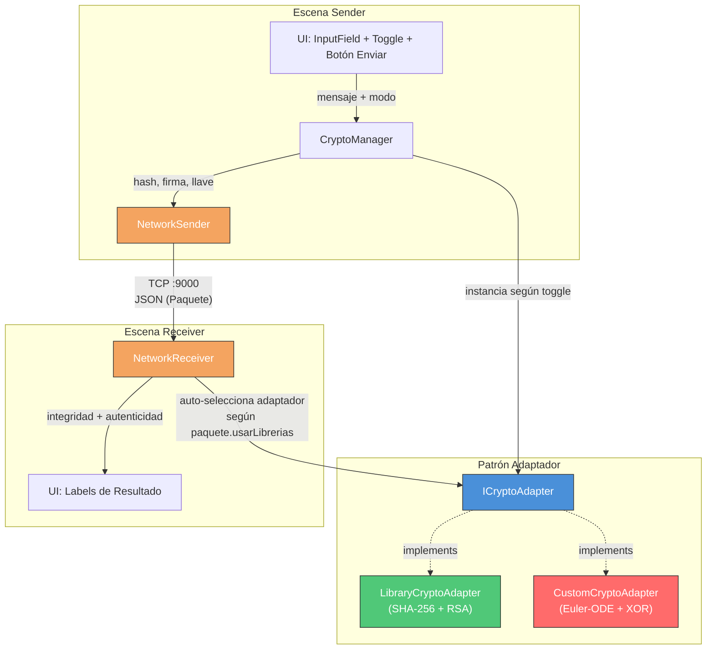
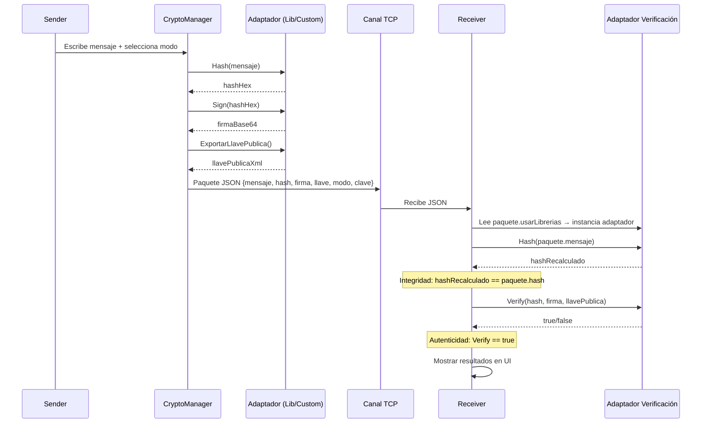
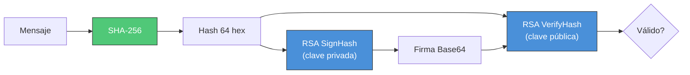
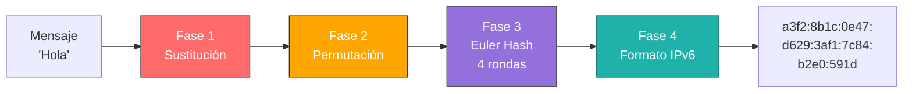
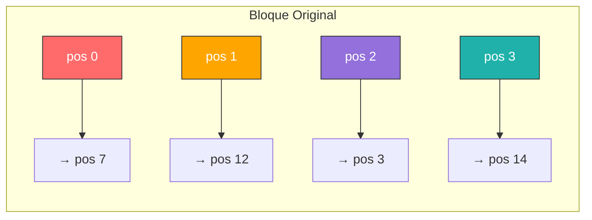
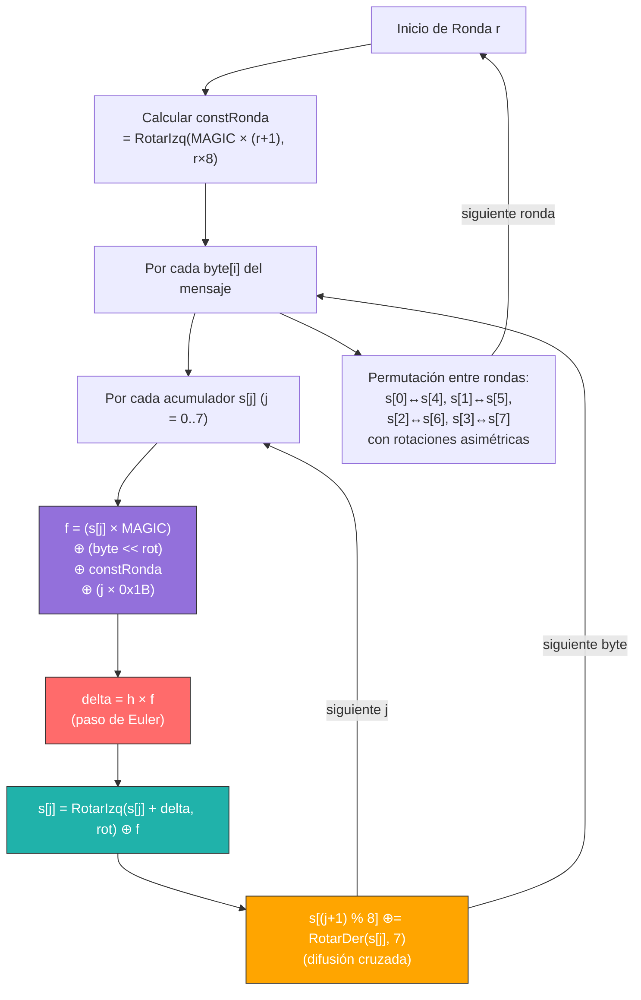
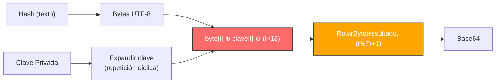
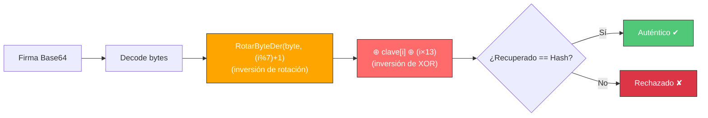
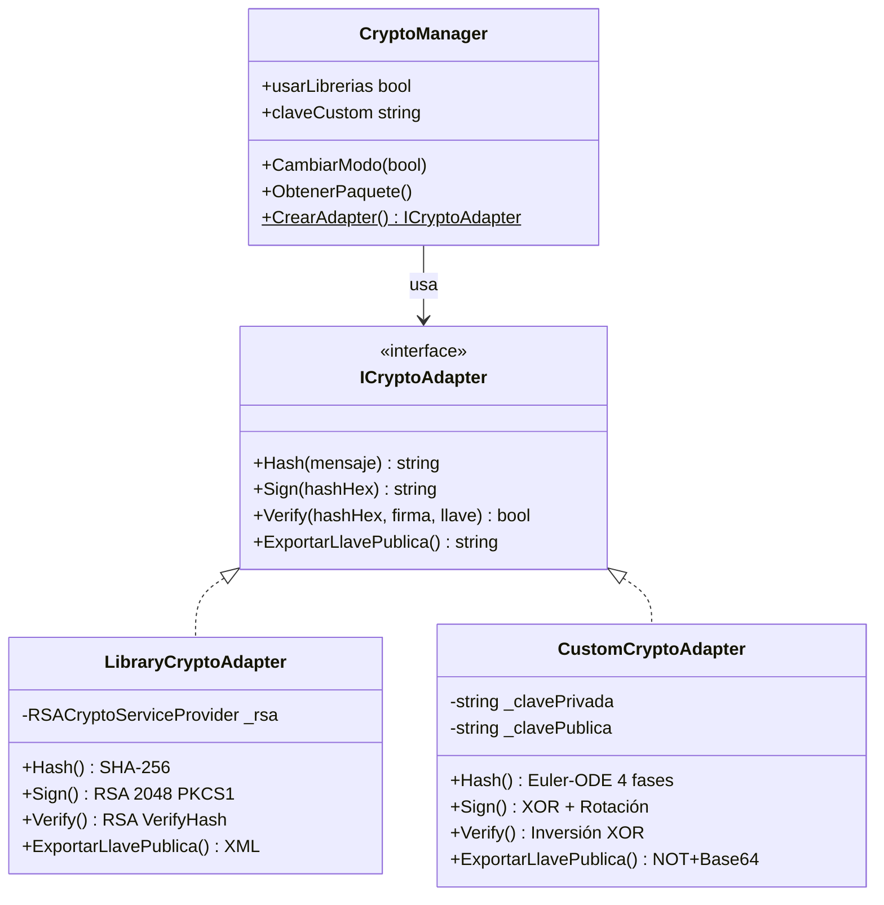

# 🔐 Taller de Firma Digital — Unity 3D

Sistema de **firma digital** en Unity 3D que implementa hashing, cifrado asimétrico y comunicación TCP para verificar **autenticidad** e **integridad** de mensajes entre dos escenas.

Soporta dos modos:
- **Librerías**: SHA-256 + RSA 2048 (System.Security.Cryptography)
- **Custom**: Hash Euler-ODE + Cifrado XOR con rotación (algoritmos propios)

---

## 📋 Tabla de Contenidos

- [Arquitectura del Proyecto](#-arquitectura-del-proyecto)
- [Flujo de Firma Digital](#-flujo-de-firma-digital)
- [Modo Librerías (SHA-256 + RSA)](#-modo-librerías-sha-256--rsa)
- [Modo Custom (Euler-ODE + XOR)](#-modo-custom-euler-ode--xor)
  - [Pipeline de Hash](#pipeline-de-hash-4-fases)
  - [Fase 1 — Sustitución](#fase-1--sustitución)
  - [Fase 2 — Permutación](#fase-2--permutación)
  - [Fase 3 — Euler Hash (EDO)](#fase-3--euler-hash-edo)
  - [Fase 4 — Formato IPv6](#fase-4--formato-ipv6)
  - [Firma (Sign)](#firma-sign)
  - [Verificación](#verificación)
- [Patrón Adaptador](#-patrón-adaptador)
- [Estructura de Carpetas](#-estructura-de-carpetas)
- [Escenas](#-escenas)
- [Cómo Ejecutar](#-cómo-ejecutar)

---

## 🏗 Arquitectura del Proyecto



---

## 🔄 Flujo de Firma Digital



---

## 📚 Modo Librerías (SHA-256 + RSA)

| Operación | Algoritmo | Detalle |
|-----------|-----------|---------|
| **Hash** | SHA-256 | `System.Security.Cryptography.SHA256` → 64 chars hex |
| **Firma** | RSA 2048 + PKCS#1 | `RSACryptoServiceProvider.SignHash()` → Base64 |
| **Verificación** | RSA | `VerifyHash()` con llave pública XML |
| **Llave pública** | RSA XML | `ToXmlString(false)` — solo componente público |



---

## 🧪 Modo Custom (Euler-ODE + XOR)

### Pipeline de Hash (4 Fases)



---

### Fase 1 — Sustitución

Cada carácter del mensaje se reemplaza por un código alfanumérico de **6 caracteres** usando un diccionario fijo de 62 entradas (a-z, A-Z, 0-9, ñ).

```
Entrada:  "Ho"
Salida:   "Lk3NvA" + "8rjr9w" = "Lk3NvA8rjr9w"
```

| Tipo | Ejemplo | Código |
|------|---------|--------|
| Minúscula | `a` → `9oiL7y` | `h` → `8DTEyw` |
| Mayúscula | `H` → `Lk3NvA` | `O` → `Ib8HnX` |
| Dígito | `0` → `n4Vx2Q` | `7` → `p0Cs4M` |

> Los caracteres no mapeados (espacios, puntuación) pasan sin modificación.

**Propósito**: Expansión del mensaje (~6x) y confusión — elimina la relación directa entre el carácter original y su representación binaria.

---

### Fase 2 — Permutación

Los bytes se reorganizan en **bloques de 16** según una tabla de permutación fija:

```
Tabla: { 7, 12, 3, 14, 1, 10, 5, 0, 15, 6, 11, 2, 9, 4, 13, 8 }

Posición original:  [ 0  1  2  3  4  5  6  7  8  9 10 11 12 13 14 15 ]
Posición nueva:     [ 7 12  3 14  1 10  5  0 15  6 11  2  9  4 13  8 ]
```



- Si el último bloque tiene menos de 16 bytes, se **rellena con `0xFF`**
- **Propósito**: Romper patrones posicionales antes de la mezcla

---

### Fase 3 — Euler Hash (EDO)

El corazón del algoritmo. Aplica el **método de Euler** para integración de EDOs como función de compresión, ejecutando **4 rondas** sobre **8 acumuladores de 32 bits**.

#### Analogía con Métodos Numéricos

```
EDO clásica:   y' = f(y, t)     →  y[n+1] = y[n] + h · f(y[n], t[n])
Euler Hash:    s[j]' = f(s,b)   →  s[j]   = s[j]  + h · f(s[j], byte[i], constRonda)
```

#### Estado Inicial

8 semillas derivadas de las fracciones decimales de las raíces cuadradas de los primeros 8 primos (las mismas constantes de SHA-256):

```
s[0] = 0x6A09E667    s[4] = 0x510E527F
s[1] = 0xBB67AE85    s[5] = 0x9B05688C
s[2] = 0x3C6EF372    s[6] = 0x1F83D9AB
s[3] = 0xA54FF53A    s[7] = 0x5BE0CD19
```

#### Constantes

| Constante | Valor | Propósito |
|-----------|-------|-----------|
| `RONDAS` | 4 | Número de pasadas completas |
| `H_EULER` | 0.25 | Paso de integración |
| `MAGIC` | `0x9E3779B9` | Constante áurea (φ × 2³²) — dispersión |

#### Flujo por Ronda



#### Operaciones clave en cada paso:

1. **Función de mezcla `f`**: `(s[j] × MAGIC) ⊕ (byte << rot) ⊕ constRonda ⊕ (j × 0x1B)`
   - Multiplicación por MAGIC → dispersión no lineal
   - XOR con byte desplazado → introduce el dato
   - XOR con constRonda → diferencia cada ronda
   - XOR con `j × 0x1B` → diferencia cada acumulador

2. **Paso de Euler**: `delta = 0.25 × f` — modulación de la velocidad de cambio

3. **Actualización**: `s[j] = RotarIzq(s[j] + delta, rot) ⊕ f` — integración + irreversibilidad

4. **Difusión cruzada**: `s[(j+1) % 8] ⊕= RotarDer(s[j], 7)` — efecto avalancha global

#### Permutación entre rondas

Después de cada ronda, los acumuladores se cruzan:

```
s[0] ←→ s[4]   (con RotarIzq 13 bits)
s[1] ←→ s[5]   (con RotarDer 17 bits)
s[2] ←→ s[6]
s[3] ←→ s[7]
```

Las rotaciones asimétricas (13 y 17) aseguran que el intercambio no se cancele en rondas sucesivas.

---

### Fase 4 — Formato IPv6

Los 8 acumuladores de 32 bits se **pliegan** a 16 bits cada uno:

```
grupo[i] = (s[i] >> 16) ⊕ (s[i] & 0xFFFF)
```

Resultado final: **8 grupos de 4 hex separados por `:`**

```
Ejemplo: a3f2:8b1c:0e47:d629:3af1:7c84:b2e0:591d
```

**Propósito**: Compresión final con pérdida de información (irreversibilidad) y formato legible.

---

### Firma (Sign)



1. Convierte el hash a bytes UTF-8
2. **Expande la clave** privada cíclicamente hasta igualar el largo del hash
3. Por cada byte: `XOR(hash[i], clave[i], i×13)` → **rotación de bits** a la izquierda
4. Resultado codificado en **Base64**

La operación `i × 13` agrega una componente posicional que evita que bytes iguales en distintas posiciones produzcan la misma firma.

---

### Verificación



El proceso de verificación invierte exactamente cada operación de la firma:
1. Decodifica Base64
2. **Rota a la derecha** (invierte la rotación izquierda del Sign)
3. **XOR** con la misma clave y posición (XOR es su propia inversa)
4. Compara el texto recuperado con el hash

Adicionalmente, antes de descifrar, verifica que la llave pública recibida coincida con la derivada de la clave privada local.

---

### Derivación de Llave Pública

```csharp
// NOT bit a bit de cada byte → Base64
byte[] b = Encoding.UTF8.GetBytes(clavePrivada);
for (int i = 0; i < b.Length; i++) b[i] = (byte)~b[i];
return Convert.ToBase64String(b);
```

```
"gato" → bytes [103, 97, 116, 111] → NOT → [152, 158, 139, 144] → Base64
```

---

## 🔌 Patrón Adaptador



El patrón adaptador permite intercambiar entre implementaciones **sin modificar** el flujo de firma digital ni la comunicación TCP. `CryptoManager` actúa como fábrica y orquestador.

---

## 📁 Estructura de Carpetas

```
Assets/
├── Scenes/
│   ├── Tcp_Sender.unity          # Sender con librerías
│   ├── Tcp_Receiver.unity        # Receiver con librerías
│   ├── Custom_Sender.unity       # Sender con algoritmos propios
│   └── Custom_Receiver.unity     # Receiver con algoritmos propios
│
└── Scripts/
    ├── Adapters/
    │   ├── ICryptoAdapter.cs       # Interfaz del patrón adaptador
    │   ├── LibraryCryptoAdapter.cs # SHA-256 + RSA (librerías .NET)
    │   └── CustomCryptoAdapter.cs  # Euler-ODE + XOR (algoritmos propios)
    │
    ├── Network/
    │   ├── Paquete.cs              # Modelo de datos para TCP
    │   ├── NetworkSender.cs        # Envío TCP con serialización JSON
    │   └── NetworkReceiver.cs      # Recepción TCP + verificación
    │
    └── Core/
        ├── CryptoManager.cs        # Orquestador + factory de adaptadores
        └── FirmaDigital.cs         # Script de prueba/debug
```

---

## 🎮 Escenas

| Escena | Modo | Adaptador |
|--------|------|-----------|
| `Tcp_Sender` | Librerías | `LibraryCryptoAdapter` (SHA-256 + RSA) |
| `Tcp_Receiver` | Librerías | Auto-detecta del paquete |
| `Custom_Sender` | Custom | `CustomCryptoAdapter` (Euler-ODE + XOR) |
| `Custom_Receiver` | Custom | Auto-detecta del paquete |

> El Receiver **auto-detecta** qué adaptador usar leyendo el campo `usarLibrerias` del paquete JSON recibido.

---

## 🚀 Cómo Ejecutar

1. Abrir el proyecto en **Unity 2022+**
2. Para probar con **librerías**:
   - Abrir `Tcp_Receiver.unity` con Open Additive Scene
   - Abrir `Tcp_Sender.unity`
   - Play → escribir mensaje → clic en **Enviar**
3. Para probar con **algoritmos propios**:
   - Usar `Custom_Sender.unity` y `Custom_Receiver.unity`
   - Asegurar que `usarLibrerias = false` en el CryptoManager
4. Verificar en la consola del Receiver:
   - **Integridad: OK** → el hash recalculado coincide
   - **Autenticidad: OK** → la firma fue verificada con la llave pública

---

## 🛠 Tecnologías

- **Unity 3D** 2022+
- **C#** / .NET
- **System.Security.Cryptography** (SHA-256, RSA)
- **TCP Sockets** (`System.Net.Sockets`)
- **TextMesh Pro** para UI
- **JsonUtility** para serialización
